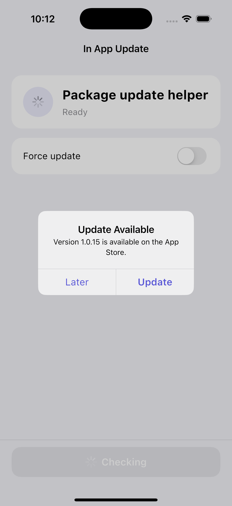

[](https://pub.dev/packages/in_app_update_plus)

Maintained by [Jonas Bark](https://twitter.com/boni2k)

# in_app_update_plus

Enables in-app update checks on Android and iOS.

https://developer.android.com/guide/app-bundle/in-app-updates


## Screenshots

### iOS



## Documentation

The following methods are exposed:
- `Future<AppUpdateInfo> checkForUpdate({String? countryCode, String? appStoreId})`: Checks if there's an update available
- `Future<AppUpdateDialogResult> checkAndShowUpdateDialog(BuildContext context, {...})`: Checks for updates and shows the platform update flow with package-provided iOS dialog UI
- `Future<AppUpdateResult> performImmediateUpdate()`: Performs an immediate update on Android or opens the App Store page on iOS
- `Future<AppUpdateResult> startFlexibleUpdate()`: Starts a flexible background download on Android or opens the App Store page on iOS
- `Future<void> completeFlexibleUpdate()`: Installs a downloaded flexible update on Android and completes immediately on iOS

Please have a look in the example app on how to use it!

For the simplest integration, let the package handle the update prompt:

```dart
await InAppUpdate.checkAndShowUpdateDialog(
  context,
  appStoreId: '1234567890',
  countryCode: 'US',
);
```

On Android this launches Google Play's native update UI when an update is allowed.
On iOS this shows a built-in Cupertino update dialog, then opens the App Store
when the user taps Update.

### Android

This plugin integrates the official Android APIs to perform in app updates that were released in 2019:
https://developer.android.com/guide/app-bundle/in-app-updates

### iOS
iOS does not offer a Play-Core-style in-app update flow. On iOS this plugin:

- checks App Store metadata through Apple's lookup API using the app bundle identifier or an optional `appStoreId`
- compares the App Store version with `CFBundleShortVersionString`
- exposes iOS metadata through `availableVersionName`, `installedVersionName`, `storeUrl`, `appStoreId`, and `releaseNotes`
- can show a package-provided Cupertino update dialog through `checkAndShowUpdateDialog`
- opens the App Store page when an update method is called

Use `countryCode` when your App Store listing should be checked in a specific country, for example:

```dart
final updateInfo = await InAppUpdate.checkForUpdate(countryCode: 'US');
```

# Troubleshooting

## Getting ERROR_API_NOT_AVAILABLE error
Be aware that this plugin cannot be tested locally. It must be installed via Google Play to work. 
Please check the official documentation about In App Updates from Google:

https://developer.android.com/guide/playcore/in-app-updates/test

## Update does not work on old Android versions
In App Updates are only available from API Versions >= 21, as mentioned [here](https://developer.android.com/guide/playcore/in-app-updates).
